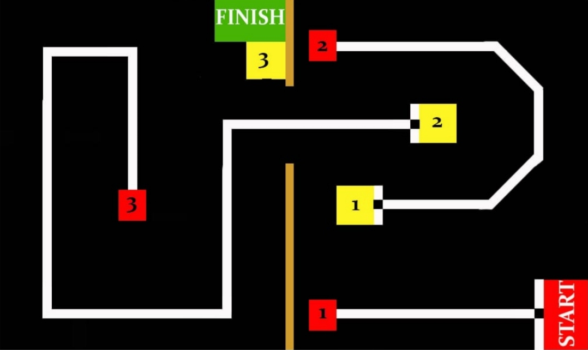

# ROBOTA-2k19

## INTRODUCTION
#### Thanos and The Curious Bot: 
Thanos has access to the three infinity stones - Mind, Time and Space. But his robo daughter  Nebula has gone rogue. He needs to get the other three stones (Soul, Power, Reality) to achieve his  goal ('The Snap'). Since Thanos is busy with the Avengers, help Thanos create a bot that help get  the other infinity stones .The three infinity stones are located in three different places, you need to  get the three stones and place them in the Base. 

## TASK 
Design a Semi-Autonomous robot which could retrieve the stone by following a defined path. 
*The game involves the use of IR sensors, which would be used to complete the line following part,  and the Bluetooth module which would be used for the locomotion. 

## BOT SPECIFICATIONS  
  • The Bot should be fully Bluetooth controlled. 
  • The dimensions of bot at the start of the game should not exceed 25cm x 25cm x 25cm .In other  words, each of the robots should completely fit within a box having respective dimensions.  
  • The weight of the robot should not exceed 5 kg. The remote control (wireless/wired), batteries etc.  all of which is to be included in the weight.  
  • The potential difference between any two points in the robot should not exceed 12V at any point  of time during the match.  
  • Teams will be provided a power supply (220V AC supply) on the arena, teams have to bring their  own adapters (for 12V-2A power supply).  
  • The rpm of motor should not exceed 300rpm.  

## GAME PLAY 
  1. Each match will have a total time limit of 15 minutes until the quarter finals. The length of the  match will increase from quarter finals onwards. 
  2. The game will start with bot at the start point of arena. 
  3. As the game starts the Bot will move autonomously along the path on its own and when it  detects an obstacle (box) it switches over to the manual mode in which the player will control  the bot via Bluetooth, lift/drag the box and place it over at the marked location.  
  4. RED marked squares represents boxes and YELLOW marked boxes represents bases. 
  5. Any one player will control the bot in each game. There can be no switching between the team  controllers. 
  6. Rules for Tie breaker will be disclosed at the time of the event.
  7. The time of the match will only be recorded from referees' stopwatch. 

## ARENA FOR EVENT

### Code for mobility of robot : [robota.ino](/robota.ino)
